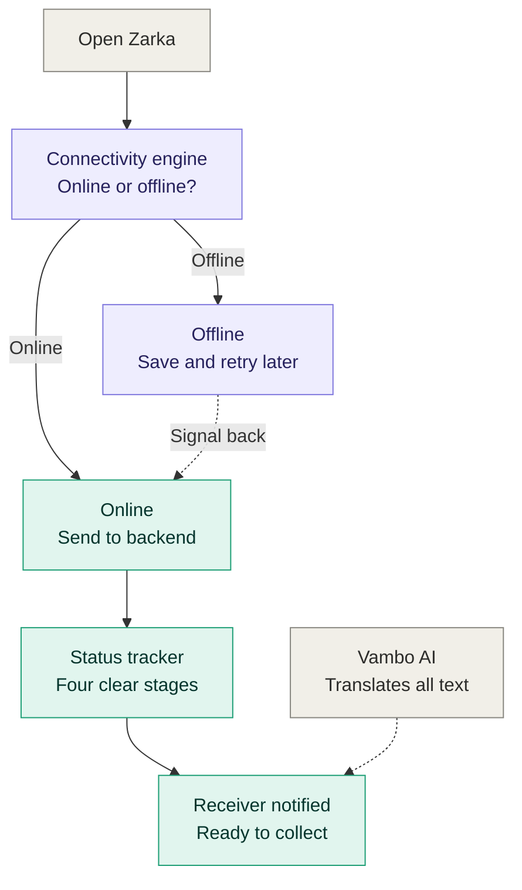

## Architecture

Zarka is an offline-first money transfer app for Southern Africa. Smartphones save every transfer locally and sync when the internet returns. Button phones use USSD and SMS over the normal phone signal, so they work with no data at all.

## How Zarka works

### Components

| Component | Role |
|---|---|
| Mobile UI | The only screen the user touches. Reads and writes the local store, never calls the network directly. |
| Connectivity engine | Detects internet, queues transfers while offline, retries with backoff, syncs in order. |
| Local store | IndexedDB holds the outbox, history and cached rates. A service worker caches the app shell. |
| Button phone | USSD menus and SMS over the phone signal. No app and no data needed. |
| Gateway | One entry point for the app (HTTPS) and for button phones (USSD and SMS). Handles auth and rate limiting. |
| Transfers | Uses the unique transfer ID so a retry never sends money twice. Writes the ledger. |
| Vambo AI proxy | Translates menus, help and receipts into local languages. The API key stays on the server. |
| Payout partner | Mobile money, bank or cash pickup (mocked for the MVP). |

### Design rules

- Write locally first, then sync. Never block the user on the network.
- Every transfer has a client-generated unique ID, and the server treats repeats as the same transfer.
- Show "Waiting" until the server confirms. Never show "Sent" early.